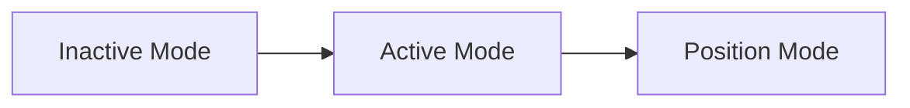
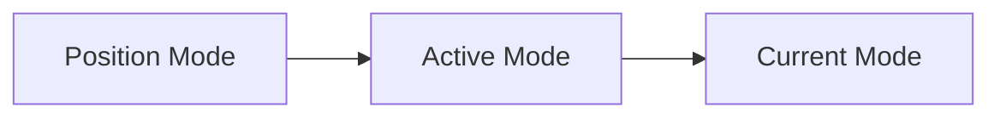

# Amber_API

## Units & Definitions:

Length: meters
Angle: radians

## Import Library(test)

```python
from amber_api.amber_robot import Amber_Robot
```

## Initialize 

```python
# Set ip address
IP_ADDR = "192.168.50.3"
# Set port
PORT = 26001
# Set joint count
joint_count = 7
arm = Amber_Robot(IP_ADDR, PORT, joint_count=joint_count)
```

During initialization, you need to provide the IP address, port number and number of joints of the robotic arm to be connected.


## Mode Control

The robotic arm enters inactive mode when initially powered on. It needs to enter active mode and then switch to position mode. The robotic arm will consider the current position preliminary and try to maintain the current position.




When dragging and teaching, when switching from position mode to current mode, you must go through Active Mode (current version)




You also need to go through Active Mode when switching in reverse.


The supported modes are shown in the table below

| Mode | inactive | Active | Position | Speed | Current |
| ---- | -------- | ------ | -------- | ----- | ------- |
| Code | 0        | 1      | 2        | 3     | 4       |

❗ When switching between modes, please ensure that the robot arm is in the zero position (or the initial position)

When switching modes, the robot arm will instantly cut off power for a moment. If it is not at the zero position, it may easily cause personal injury or property damage.

### set_position_mode()

It will entering active mode and then entering position mode.

Using this function no longer requires manually enter active mode anymore

```python
arm.set_position_mode()
```

**Parameter**

none

**Return value**

Boolean, True=success, False=failure

### set_current_mode()

It will entering active mode and then entering current mode.

Using this function no longer requires manually enter active mode anymore

```python
arm.set_current_mode()
```

**Parameter**

none

**Return value**

Boolean, True=success, False=failure

### get_mode()

Query the mode of each joint

```
list = arm.get_mode()
```

**Parameter**

none

**Return value**

List, Contains 7 codes, explanation is shown in the table above

## Get Status

Query the current status of the robotic arm. Currently, two lists are returned

- The arc of rotation of each joint.
- Cartesian coordinates of the end relative to the base of the robotic arm.

```
j_pos, c_pos = arm.get_status()
```

**Parameter**

none

**Return value**

2 Lists, see above

## Move

### move_j()

Rotate each joint

```
arm.move_j(target, duration)
```

**Parameter**

- **target**: List containing seven values. Represents the target angle (radians) of each joint
  - If on a six-axis system, fill in the seventh value with 0
- **duration**: The time it is expected to take for the robot arm to rotate. If it is set too short, it will not exceed the physical limit of the robot arm.

**Return value**

Boolean, True=success, False=failure

### move_c()

Move the end to the specified Cartesian coordinates

```
arm.move_c(target, duration)
```

**Parameter**

- **target**: List containing six values. Represents the target Cartesian coordinates([X, Y, Z, Roll,Pitch,Yaw]) of End Effector
- **duration**: The time it is expected to take for the robot arm to rotate. If it is set too short, it will not exceed the physical limit of the robot arm.

**Return value**

Boolean, True=success, False=failure

### move_zero()

Provides a faster way to move the robotic arm to the zero position

```
arm.move_zero()
```

**Parameter**

none

**Return value**

Boolean, True=success, False=failure

## Wait&Block

#### wait_for_joint()

Blocks until joint rotation reaches accuracy requirements or times out

```
arm.wait_for_joint(target, timeout, accuracy)
```

**Parameter**

- **target**: List containing seven values. Represents the target angle (radians) of each joint
- timeout (Optional): Set blocking  timeout, The default value is 10
- accuracy (Optional): Sets the precision to which returns must be made

**Return value**

Boolean, True=success, False=failure

#### wait_for_cartesian()

Blocks until joint rotation reaches accuracy requirements or times out

```
arm.wait_for_cartesian(target, timeout, accuracy)
```

**Parameter**

- **target**: List containing six values. Represents the target Cartesian coordinates([X, Y, Z, Roll,Pitch,Yaw]) of End Effector
- timeout (Optional): Set blocking  timeout, The default value is 10
- accuracy (Optional): list[6]Sets the precision to which returns must be made: Cartesian coordinates([X, Y, Z, Roll,Pitch,Yaw]) 

**Return value**

Boolean, True=success, False=failure

## I/O Tools

### gripper_calibrate()

The gripper needs to be recalibrated after each power down and power up.

```
arm.gripper_calibrate()
```

**Parameter**

none

**Return value**

Boolean, True=success, False=failure

### gripper_ctrl

Control V1/G1 force controlled gripper

```python
arm.gripper_ctrl(action,force)
```

**Parameter**

- **action**: 0 means to Release，1 means to Hold.
- **force**:  the Intensity of holding(range: 1\~300)；default 10.

**Return value**

Boolean, True=success, False=failure

## Other class variables

### joint_upper_limit

Allows further setting of joint upper limits.

The following example sets the upper limit of each joint to 0.5 radians

```
arm.joint_upper_limit = [0.5, 0.5, 0.5, 0.5, 0.5, 0.5,0.5]
```

### joint_lower_limit

Allows further setting of joint lower limits.

The following example sets the lower limit of each joint to 0.5 radians

```
arm.joint_lower_limit = [0.5, 0.5, 0.5, 0.5, 0.5, 0.5,0.5]
```

